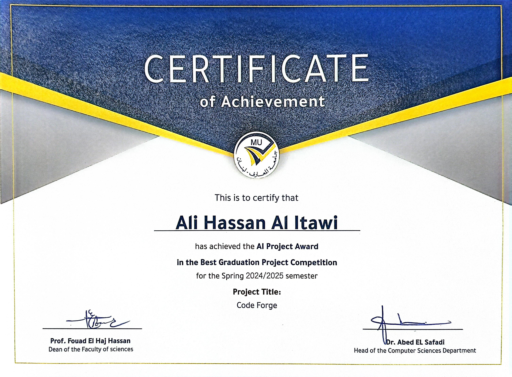

# 🏆Code Forge: AI-Powered Full-Stack App Generator

<div align="center">


**🥇 Best AI Graduation Project Award – Spring 2025**  
***Al Maaref University***

[](https://www.oracle.com/java/)
[](https://spring.io/projects/spring-boot)
[](https://nextjs.org/)
[](https://www.deepseek.com/)
[](https://www.typescriptlang.org/)
[](https://www.maaref.edu.lb/)

</div>

---

## 🚀 Introduction

> **"Precision at the speed of thought. That's how Code Forge works."**

Code Forge is a **revolutionary AI-powered full-stack application generator** that transforms your ideas into production-ready applications in **just one minute**! This award-winning graduation project represents the pinnacle of modern software engineering, leveraging cutting-edge artificial intelligence to completely automate the development process, from sophisticated backend APIs to responsive, interactive frontend interfaces.

**🎯 The Power of Code Forge:**
- ⚡ **Full-Stack Generation in 60 seconds**
- 🤖 **AI-Driven Architecture Design**
- 🏗️ **Production-Ready Code Output**
- 🔗 **Intelligent Entity Relationships**
- 🎨 **Beautiful, Modern UI Components**

---

## 🎯 The Critical Problem We Solved

### 💔 The Development Crisis
We believe that building full-stack applications shouldn't be a barrier to innovation. However, traditional development faces **critical bottlenecks** that stifle creativity and progress:

❌ **Time-Consuming Development** – Developers waste **days or weeks** writing repetitive boilerplate code before they can even start building real business features

❌ **Error-Prone Manual Setup** – Manual project configuration leads to bugs, inconsistent architecture, and endless debugging sessions

❌ **Innovation Bottleneck** – Countless brilliant ideas never see the light of day because of overwhelming technical overhead and setup complexity

❌ **Knowledge Barriers** – Junior developers struggle with complex configurations while senior developers get bogged down in repetitive tasks

### ✅ Our Revolutionary Solution

**Code Forge eliminates these pain points by automating the heavy lifting, empowering developers to focus on what matters most: Innovation and Business Logic.**

🚀 **Instant Generation** – Complete, tested full-stack applications generated in under 60 seconds  
🎯 **AI-Driven Precision** – Intelligent entity relationships, optimized database schemas, and clean architecture  
🏆 **Production-Ready Output** – Scalable, maintainable code that follows industry best practices  
🔧 **Zero Configuration** – No setup required, just describe your idea and watch it come to life  

---

## 🏆 Project Achievements & Milestones

Our development journey was a testament to perseverance, innovation, and technical excellence. Each milestone represents months of intensive research, development, and refinement:

### 🏗️ Milestone 1: Foundation Architecture & Core Generation Engine


**What We Achieved:**
- ✅ **Advanced Spring Boot Project Structure Generation** - Automated creation of enterprise-grade project architectures with proper package organization
- ✅ **Intuitive Entity Creation Interface** - User-friendly web interface for defining complex business entities with real-time validation
- ✅ **Dynamic Attribute Definition System** - Flexible attribute system supporting multiple data types, validations, and constraints
- ✅ **Intelligent CRUD Operations Generation** - Automated creation of Create, Read, Update, Delete operations with proper error handling and validation

**Technical Impact:** This milestone laid the foundation for scalable code generation, establishing the core architecture that would support advanced AI integration.

### 🔐 Milestone 2: AI Revolution & Security Integration


**What We Achieved:**
- ✅ **Enterprise-Grade Authentication & Authorization** - Complete JWT-based security system with role-based access control
- ✅ **Advanced JSON Parsing Engine** - Robust parsing system capable of handling complex, nested entity definitions from AI responses
- ✅ **Sophisticated Prompt Engineering** - Meticulously crafted AI prompts that consistently generate high-quality, production-ready code
- ✅ **DeepSeek AI Integration** - Seamless integration with state-of-the-art AI models for intelligent code generation and entity relationship inference

**Technical Impact:** This milestone transformed Code Forge from a simple generator into an intelligent AI-powered development assistant.

### 🎨 Milestone 3: Advanced Features & Complete Integration


**What We Achieved:**
- ✅ **Advanced Behavioral Services Implementation** - Generated services with complex business logic, transaction management, and error handling
- ✅ **Professional Dashboard Template Creation** - Modern, responsive dashboard templates with advanced UI components
- ✅ **Seamless Frontend-Backend Integration** - Complete integration between generated APIs and frontend interfaces with real-time data binding
- ✅ **Interactive Project Leaderboard System** - Gamification features to track and showcase development achievements

**Technical Impact:** This milestone completed the vision of a truly comprehensive full-stack generator capable of producing enterprise-level applications.


---

## 💪 Technical Challenges Overcome - The Real Engineering Pain


The development of Code Forge required overcoming some of the most complex technical challenges in modern software engineering. These weren't just coding problems, they were fundamental computer science challenges that pushed the boundaries of what's possible:

### 🔗 **Entity Relationships Handling from AI**
**The Pain:** AI models don't naturally understand complex database relationships. Getting DeepSeek to generate proper foreign keys, join tables, and cascade operations was like teaching a brilliant mathematician to become a database architect.

**Our Solution:** We developed a sophisticated relationship inference engine that:
- Parses natural language descriptions into formal relationship definitions
- Automatically generates proper foreign key constraints
- Creates intelligent cascade operations based on business logic
- Validates relationship integrity across complex entity hierarchies

### 📊 **Advanced JSON Parsing**
**The Pain:** AI responses are unpredictable. Sometimes DeepSeek returns perfect JSON, sometimes malformed structures, sometimes valid JSON with unexpected nesting. Traditional parsing fails catastrophically.

**Our Solution:** We built a resilient parsing system that:
- Handles malformed JSON with intelligent error correction
- Adapts to varying response structures dynamically
- Maintains data integrity even with partial failures
- Provides meaningful fallbacks for corrupted responses

### 🔍 **Complex Regular Expressions**
**The Pain:** Code generation requires parsing and manipulating thousands of lines of generated code with surgical precision. One wrong regex pattern could corrupt entire projects.

**Our Solution:** We engineered battle-tested regex patterns that:
- Handle edge cases in generated code structures
- Support multiple programming languages and frameworks
- Maintain code formatting and style consistency
- Enable safe code injection without breaking existing functionality

### 🎯 **Prompt Engineering Excellence**
**The Pain:** Getting consistent, high-quality responses from AI models is an art form. Poor prompts lead to inconsistent code, missing features, or complete generation failures.

**Our Solution:** We developed a comprehensive prompt engineering framework:
- Context-aware prompts that adapt to project complexity
- Multi-stage prompt chains for complex generation tasks
- Validation loops that ensure output quality
- Fallback strategies for edge cases

### 🌐 **Generic Frontend Integration**
**The Pain:** Creating frontend components that work seamlessly with ANY generated backend API is like building a universal translator for programming languages.

**Our Solution:** We architected a universal frontend system:
- Dynamic component generation based on API schemas
- Automatic form validation based on backend constraints
- Responsive layouts that adapt to any data structure
- Real-time API integration with intelligent error handling

### 📁 **High-Performance File I/O Operations**
**The Pain:** Generating entire projects requires creating hundreds of files, directories, and configurations simultaneously while maintaining consistency and avoiding conflicts.

**Our Solution:** We implemented an enterprise-grade file management system:
- Atomic file operations to prevent corruption
- Intelligent conflict resolution for existing projects
- Optimized I/O operations for large project generation
- Comprehensive backup and rollback mechanisms

---

## 📊 System Architecture & Use Cases

### 🏗️ Complete System Architecture


Our architecture follows enterprise-grade patterns with clear separation of concerns, ensuring scalability and maintainability.

### 🔄 Detailed Generation Workflow


The generation process involves sophisticated AI orchestration, ensuring every component is perfectly integrated.

### 🎯 Extended Use Case Scenarios


Code Forge handles complex scenarios from simple CRUD applications to enterprise-level systems with multiple integrations.

---

## 🗄️ Intelligent Database Integration

Code Forge automatically generates optimized database schemas with proper relationships, constraints, and performance considerations.
Here's an example of a gym website database generated by Code Forge:


**What Code Forge Creates:**
- **Normalized Database Structure** - Eliminates redundancy and ensures data integrity
- **Intelligent Relationships** - Proper foreign keys, indexes, and constraints
- **Performance Optimization** - Strategic indexing and query optimization
- **Scalable Schema Design** - Built to handle growth and evolution

---

## 🎬 Live Demo: Building a Samsung E-Commerce Website

Watch Code Forge in action as it generates a complete Samsung e-commerce platform:

### Step 1: Entity Definition

*Intuitive interface for defining business entities with real-time validation*

### Step 2: Generation Configuration

*Flexible options for customizing the generated application*

### Step 3: AI-Powered Generation

*Watch as AI generates thousands of lines of production-ready code*

### Step 4: Generated Backend API

* Complete Spring Boot backend with RESTful APIs, security, and documentation*

### Step 5: Dynamic Frontend Creation

*Modern, responsive React frontend with complete CRUD operations*

### Step 6: Entity Management Dashboard

*Professional dashboard for managing all generated entities and relationships*

---

## 🛠️ Technology Stack

### Backend Powerhouse
- **Java 22** - Latest LTS with performance optimizations
- **Spring Boot 3.3.2** - Enterprise-grade framework with security
- **Spring Security** - JWT authentication and authorization
- **JPA/Hibernate** - Advanced ORM with relationship management
- **Maven** - Dependency management and build automation

### Frontend Excellence
- **Next.js 14** - React framework with SSR and optimal performance
- **TypeScript** - Type-safe development with enhanced developer experience
- **Tailwind CSS** - Utility-first CSS for rapid UI development
- **React Hook Form** - Performant forms with validation
- **Recharts** - Beautiful, responsive data visualizations

### AI Integration
- **DeepSeek API** - State-of-the-art language model for code generation
- **Custom Prompt Engineering** - Optimized prompts for consistent output
- **JSON Schema Validation** - Robust parsing and validation system

---

## 🚀 Getting Started

### Prerequisites
- **Java 22+** 
- **Node.js 18+**
- **Maven 3.9+**
- **Git**

### Quick Start
```bash
# Clone the repository
git clone https://github.com/yourusername/code-forge.git
cd code-forge

# Start the backend
./mvnw spring-boot:run

# Start the frontend dashboard
cd "Code Forge Dashboard"
npm install
npm run dev
```

### Access the Application
- **Main Application:** `http://localhost:8080`
- **Dashboard:** `http://localhost:3000`
---

## 🎓 Academic Recognition & Certification

<div align="center">



**🏆 Best AI Graduation Project Award – Spring 2025**  
***Al Maaref University***

*This certificate recognizes the exceptional innovation, technical excellence, and practical impact of Code Forge in advancing the field of AI-powered software development. The project demonstrates mastery of cutting-edge technologies, sophisticated problem-solving abilities, and the potential to transform how developers approach full-stack application development.*

---

**Project Supervisor:** Dr. Muhamad Mubarak  
**Academic Year:** 2024-2025  
**Graduation Date:** Spring 2025  
**Award Category:** Best AI Innovation Project

</div>

---

## 🤝 Contributing

We welcome contributions from the community! Code Forge represents the future of development tools, and we're excited to collaborate with fellow innovators.

### How to Contribute
1. Fork the repository
2. Create a feature branch (`git checkout -b feature/amazing-feature`)
3. Commit your changes (`git commit -m 'Add amazing feature'`)
4. Push to the branch (`git push origin feature/amazing-feature`)
5. Open a Pull Request

---

## 📄 License

This project is licensed under the MIT License - see the [LICENSE](LICENSE) file for details.

---

## 🙏 Acknowledgments

- **Al Maaref University** for providing the academic environment that fostered innovation
- **Dr. Muhamad Mubarak** for invaluable guidance and mentorship
- **DeepSeek** for providing cutting-edge AI capabilities
- **The Open Source Community** for the tools and frameworks that made this possible

---

<div align="center">

**Code Forge - Where Ideas Become Reality in 60 Seconds** ⚡

*Built with ❤️ by a passionate computer science graduate*

[🌟 Star this repository](https://github.com/ITAXBOX/Code-Forge)

</div>
